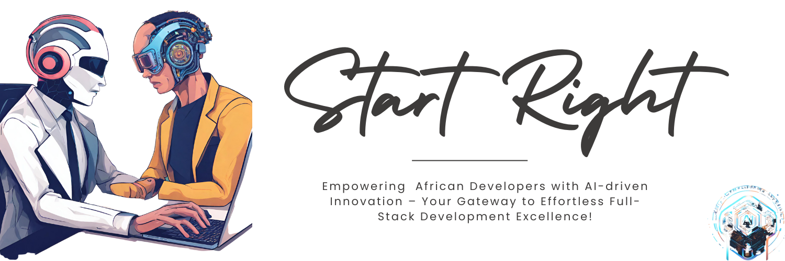

# StartRight: AI Fullstack Template App Generation Tool


> Let our AI Agents do the heavy lifting for you!

StartRight is a cutting-edge AI-driven fullstack template app generation tool that aims to revolutionize your development process. With a focus on simplicity, flexibility, and customization, StartRight currently supports HTML, Tailwind CSS, and JavaScript or React for the frontend, complemented by Rust Actix for backend CRUD operations. Our roadmap includes plans to extend support for additional programming languages and frameworks.

## Features

### 1. AI Assistance

Our AI plays a pivotal role in simplifying frontend development. It generates essential pages and hooks, streamlining the process and allowing developers to focus on building unique features. For HTML projects, it provides an index file with Tailwind CSS and JavaScript components. On the backend, it offers a ready-to-use web server file.

### 2. Multi-Language Support

StartRight is not limited to specific technologies. Currently supporting HTML, Tailwind CSS, and JavaScript or React, it is poised to become a versatile tool with plans to integrate additional programming languages and frameworks. This ensures that developers can choose the stack that best suits their project requirements.

### 3. Customizable AI Prompts

Tailor your development experience with customizable AI prompts. These prompts guide users through the project setup, enabling them to specify the type of web system they intend to build. This customization enhances the user experience and facilitates a more personalized development journey.

### 4. Future Open Source Support

StartRight has a forward-looking approach, with plans to support emerging open-source language models. Future updates will include integration with language models such as Google's Palma, Meta's Llama2, and other potential additions. This commitment to ongoing innovation ensures that StartRight remains at the forefront of accessible and cutting-edge development.

## Installation Instructions

Follow these comprehensive steps to seamlessly set up StartRight on your machine:

1. **Rust Installation:** Install Rust on Linux. Ensure that your Rust version is at least `rustc 1.69.0 (84c898d65 2023-04-16)` or a later version.

2. **Repository Cloning:** Clone the StartRight repository using the following command:
    ```bash
    git clone https://github.com/martin-creator/Start-Right.git
    ```

3. **Directory Navigation:** Navigate into the Start-Right directory:
    ```bash
    cd Start-Right
    ```

4. **Build Process:** Run the following command to build the binary:
    ```bash
    cargo build
    ```

5. **Environment Configuration:** Rename `sample_env` to `.env` and replace it with your OpenAI secret keys and organization ID.

6. **Run Application:** After setting up, initiate the console application with:
    ```bash
    cargo run --bin main
    ```

7. **Web Template Access:** To access the generated web template, run:
    ```bash
    cargo run --bin main_web_template
    ```

8. **React Frontend:** For React frontend, navigate to `frontend_react_templates` (Vite-based) and run:
    ```bash
    cargo run http://localhost:5173/
    ```

## Usage

To leverage the full stack templates provided by StartRight, follow these straightforward steps:

1. After running `cargo run` in the StartRight root folder, a prompt will ask, "What project are we starting today?"
2. Type the type of web system you intend to build, and StartRight will seamlessly handle the rest.

Note: Permission may be requested to run code on your local machine. Respond with 'yes' or 'no' to confirm.

## Project Structure

Explore the following files/folders to gain insight into the generated code:

- **Backend Web Server (Actix Rust):** `web_template.rs`
- **Index File (HTML, Tailwind CSS, JavaScript):** `frontend_index/index.html`
- **React File with API Endpoints Consumption:** `frontend_react_templates`


## Best Coding Practices supported by StartRight on Backend

1. **Modular Code Structure:**
   - Organize code into meaningful modules for maintainability.

2. **Error Handling:**
   - Implement proper error handling using Result and Option.

3. **Security Practices:**
   - Securely store passwords; configure CORS for cross-origin requests.

4. **RESTful Conventions:**
   - Follow RESTful principles; map HTTP methods to CRUD operations.

5. **Documentation:**
   - Include inline comments; document complex logic and operations.

6. **Concurrency Management:**
   - Use Mutexes for concurrent access to shared resources.

7. **Database Operations:**
   - Efficiently implement CRUD operations within the Database struct.

8. **File Operations:**
   - Save/load data from a file for persistence; handle errors.

9. **Function Naming:**
   - Use descriptive names in snake_case for functions and variables.

10. **HTTP Response Codes:**
   - Indicate success/failure with appropriate HTTP response codes.


## Future Enhancements

- **Expanded Language Model Support:** Integrate additional language models such as Google's Palma, Meta's Llama2, and other open-source products.
- **AI Language Model Compatibility:** Explore compatibility with more AI language models to enhance the development experience further.
- **Extended Language Support:**
  - Add support for Python frameworks like Flask and Django.
  - Include Node.js with Express for backend development.
  - Integrate Ruby on Rails for a Ruby-based full-stack experience.
- **Database Variety:**
  - Extend database support to PostgreSQL and MongoDB for diverse backend options.
- **UI & UX Enhancement Agents:**
  - Implement UI and UX agents to improve the design and user experience of generated applications.
- **DevOps Integration:**
  - Include necessary agents for DevOps practices, ensuring seamless integration with popular CI/CD pipelines and deployment tools.
- **Frontend Frameworks:**
    - Add support for Vue.js and Angular for frontend development.
- **Mobile App Support:**
    - Explore mobile app support for Android and iOS.


## License

This project is licensed under [Creative Commons Attribution-NonCommercial 4.0 International License]()

## Authors

- **Martin Lubowa** (martinlubowa@outlook.com)
- **Moreen Irungu** (irungumaureen1@gmail.com)

For inquiries or collaboration, please feel free to reach out to the authors.

Feel empowered to contribute and enhance StartRight! Happy coding!